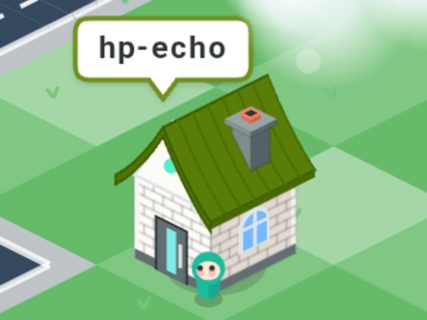

# 🏘️ GitVille - The GitHub City Generator

<div align="center">
  
</div>

<div align="center">
  <h3>
    <a href="https://addressmehari.github.io/GitVille/web/create-own">✨ Create Your Own City ✨</a>
  </h3>
  <p>Turn any GitHub Profile or Repository into a living, breathing isometric metropolis.</p>
</div>

---

## 🌟 What is GitVille?

GitVille is a procedural generation engine that turns GitHub data into an interactive, isometric city.
Every **Follower** or **Stargazer** becomes a unique house, creating a living visualization of a community.

Originally designed to visualize just *this* repo's stargazers, it has evolved into a universal **"City Explorer"** for the entire GitHub ecosystem.

**Commercial Friendly**: Built with MIT-only libraries and vanilla JS. Suitable for embedding in portfolios, presentations, or SaaS dashboards.

---

## 🚀 Two Ways to Explore

### 1. The "Create Mode" (Recommended)

We built a dedicated tool to generate, preview, and download city snapshots instantly.

**[👉 Click Here to Open the Creator Tool](https://addressmehari.github.io/GitVille/web/create-own)**

- Enter **Any Username** (e.g., `torvalds`)
- Enter **Any Repository** (e.g., `facebook/react`)
- Download premium **SVG Cards** for your README or social media.

### 2. The "Explorer Mode"

View the city in its full interactive glory—with weather, day/night cycles, and walking citizens.

`https://addressmehari.github.io/GitVille/web/?u={USERNAME_OR_REPO}`

---

## ✨ Features

- **∞ Universal Compatibility**: Works with any public GitHub User or Repository.
- **⚡️ Client-Side Generation**: No backend required. Your browser fetches data directly from GitHub.
- **🏙️ Massive Scale**: Intelligently renders cities up to **1,000 houses** with zero lag using a creative "Ghost Citizen" system for huge communities.
- **📸 Premium Snapshots**: Generate high-fidelity SVG cards with shadows, gradients, and animations directly in the browser.
- **🎨 Live Aesthetics**:
  - **Dynamic Weather**: Rain, wind, and cloud systems.
  - **Day/Night Cycle**: Real-time atmospheric lighting.
  - **Organic Zoning**: Algorithmically places houses and trees for a natural look.
- **🔍 Details**: Inspect any house to see the user's name and join date.

---

## 🛠️ Technical Details

The core of GitVille is a lightweight, dependency-free JavaScript engine located in `web/script.js`.

### 🏗️ City Generation Algorithm

1. **Data Fetching**:
   - Fetches the target profile/repo info from GitHub API.
   - Pulls a sample of real followers/stargazers.
   - If the community is huge (e.g., 50k stars), it procedurally generates "Ghost Citizens" to fill the city without hitting API rate limits.

2. **Zoning**:
   - Uses a diamond-expansion algorithm to create city blocks.
   - Allocates slots for houses and generates a connected road network.
   - Injects trees into empty slots (20% probability) for organic distribution.

3. **Rendering**:
   - Custom HTML5 Canvas isometric renderer.
   - Handles z-sorting (depth) to ensure correct occlusion of buildings.

### ⚠️ API Limits

GitHub allows **60 requests/hour** for anonymous IP addresses.

- If you click too fast, you might see a **Red Alert** dialog.
- This is a GitHub limitation, not a bug. Just wait a few minutes or authenticate (if running locally).

---

## 📂 Project Structure

```text
GitVille/
├── data/               # Static JSON data (for the default view)
├── scripts/            # Python helpers & SVG generators
├── web/                # The Frontend Application
│   ├── images/         # Asset textures
│   ├── create-own/     # The "Card Creator" Tool
│   ├── script.js       # Main Game Engine & Logic
│   ├── style.css       # UI Styling
│   └── index.html      # Entry Point
└── output/             # Generated artifacts (e.g. SVGs)
```

---

## 📸 Gallery

<div align="center">
  
  
  <br/>
  
  
</div>

---

Made with ❤️ for the Open Source Community

**MIT License** • Created by [Addressmehari](https://github.com/addressmehari)
